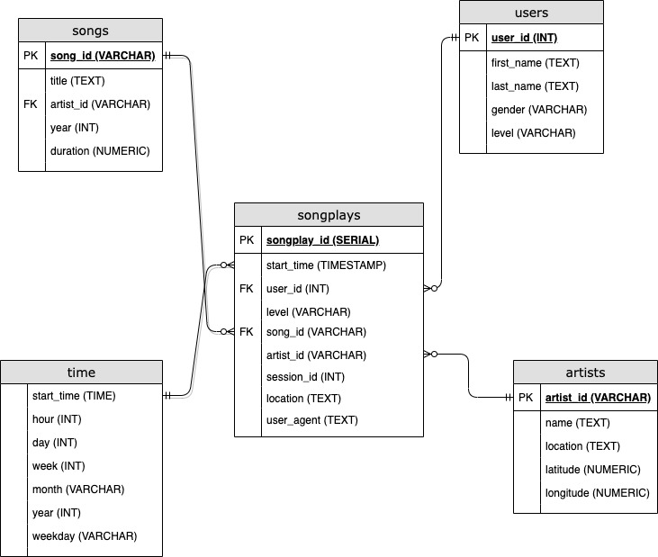
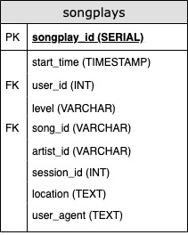
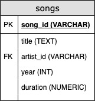
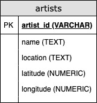
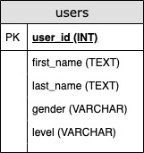
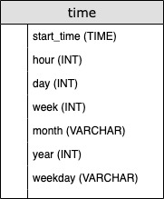
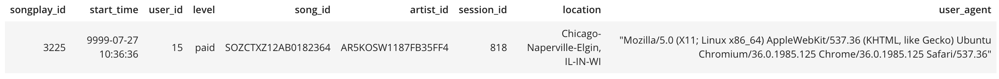
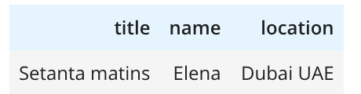

# Project: Data Modeling for Sparkify

## Purpose
The purpose of this project is to help analytics team at Sparkify to query and analyze the data they have been collecting on songs and user activity on their music streaming app. 

## Database Schema and Design
As of today, Sparkify collects all their data and store them in json files. There are 2 types of dataset: song dataset and log dataset. Song dataset contains metadata about a song and artist of a song, e.g. artist name, song title, artist location, etc. Meanwhile, log dataset consists activity log files generated by music streaming app based on the songs in the dataset, e.g. user first name, user last name, artist name, song title, etc. As you can see, there are some duplication of data between these 2 datasets.

To help remove duplication of datas stored in DB, we will use ETL process called Star Schema to extract, transform, and load these data to DB. This will also help us to simplify query and fast aggregation of the data. Below is the Star Schema:

__From schema above__:

- Fact table is songplays table
    
    

- Dimension tables are songs table, users table, artists table, and time table
    
         
    
     

## Sample Query
To select the first 5 songs played from songPlays table where song_id is not null, we can use the following query:
> SELECT * FROM songplays WHERE song_id IS NOT NULL LIMIT 5;

And this will return us list of songs played that that look like the following:

Another sample query is to view song title, artist name, and artist location from a song id
> SELECT songs.title, artists.name, artists.location FROM songs JOIN artists ON songs.artist_id = artists.artist_id WHERE songs.song_id = 'SOZCTXZ12AB0182364';

This query will return us list that looks like the following:

## Author
Budi Sulayman

## License
This project is licensed under [MIT](https://choosealicense.com/licenses/mit/)